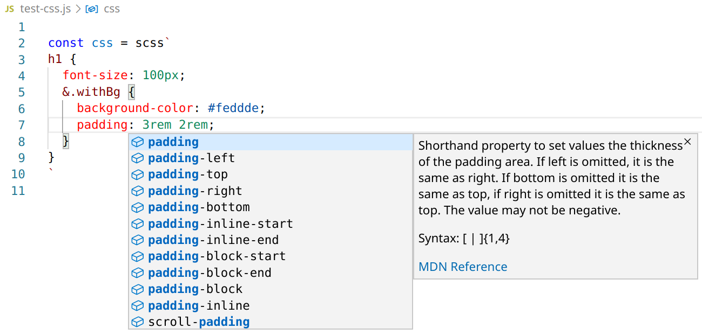

# VS Code Plugin: enhancedjs.sass-in-template-string

Syntax highlighting and IntelliSense for CSS, SASS and SCSS in template strings.



Supported tags for template strings:

* `css`;
* `scss`;
* `sass`.

Notice: This is a fork of [vscode-styled-components](https://github.com/styled-components/vscode-styled-components). But with `css`, `scss` and `sass` template tags.

## Install

Inside VSCode, press `Ctrl+P`, and enter:

```
ext install enhancedjs.sass-in-template-string
```

It should be the top result.

[[Source](https://marketplace.visualstudio.com/items?itemName=enhancedjs.sass-in-template-string)]
